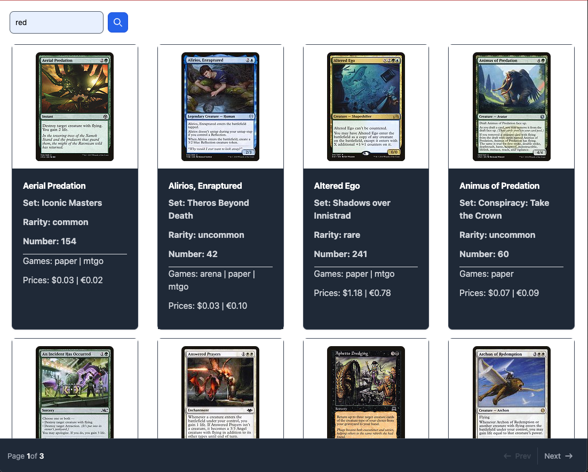

# Introduction

[](https://app.codacy.com/gh/chalu/tcgm-fullstack-demo/dashboard?utm_source=gh&utm_medium=referral&utm_content=&utm_campaign=Badge_grade)

Hello 👋,

This is a simple but *production-level full stack application.



Review this [document](./INSTRCTIONS.md) for what was expected and then take a look at the [explanation](./DESIGN_EXPLANATION.md) for my implementation details.

> ## Key Assets Delivered
>
> ***
>
> 1.  The backend [API spec](./api/spec/api.yaml), deployed at <https://tcg-api-demo.onrender.com> as documentation for integrators
> 2.  The backend [search service](./server/searchservice), deployed at [https://tcg-backend-demo.onrender.com](https://tcg-backend-demo.onrender.com/)
> 3.  The frontend [React search client](./client/r-seeker), deployed at <https://tcg-react-client-demo.onrender.com>

 

## Usage

With the latest Node LTS & Pnpm installed, run the following commands:

```bash
pnpm install
```

### Backend

To start the backend search service, run:

```bash
pnpm --filter searchservice build
pnpm --filter searchservice start
```

You should now have a Node server running on port **3001**

### Frontend

To start the frontend React app, run:

```bash
pnpm --filter r-seeker build
pnpm --filter r-seeker start:local
```

You should now have `http-server` serving the built React app from a URL displayed on the terminal. Open the URL in a browser to see the app.

### Tests

To test the backend search service, run:

```bash
pnpm --filter searchservice start:dev
```

then open another terminal window/tab and run:

```bash
pnpm --filter searchservice test
```
